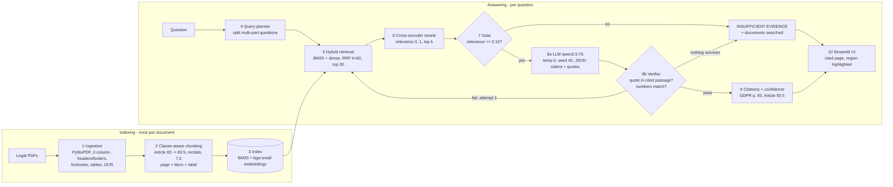

# LexiSync architecture

```mermaid
flowchart LR
    subgraph IDX[Indexing - once per document]
        D[Legal PDFs] --> I[1 Ingestion<br/>PyMuPDF, 2-column, headers/footers,<br/>footnotes, tables, OCR]
        I --> C[2 Clause-aware chunking<br/>Article 83 -> 83 5, recitals, 7.2<br/>page + bbox + label]
        C --> X[(3 Index<br/>BM25 + bge-small embeddings)]
    end

    subgraph ANS[Answering - per question]
        Q[Question] --> P[4 Query planner<br/>split multi-part questions]
        P --> R[5 Hybrid retrieval<br/>BM25 + dense, RRF k=60, top 30]
        X --> R
        R --> RR[6 Cross-encoder rerank<br/>relevance 0..1, top k]
        RR --> G{7 Gate<br/>relevance >= 0.10?}
        G -- no --> AB[INSUFFICIENT EVIDENCE<br/>+ documents searched]
        G -- yes --> L[8a LLM qwen2.5:7b<br/>temp 0, seed 42, JSON claims + quotes]
        L --> V{8b Verifier<br/>quote in cited passage?<br/>numbers match?}
        V -- fail, attempt 1 --> R
        V -- nothing survives --> AB
        V -- pass --> CI[9 Citations + confidence<br/>GDPR p. 83, Article 83 5]
        CI --> UI[10 Streamlit UI<br/>cited page, region highlighted]
        AB --> UI
    end
```

Regenerate the image version with `python scripts/make_architecture.py`.
